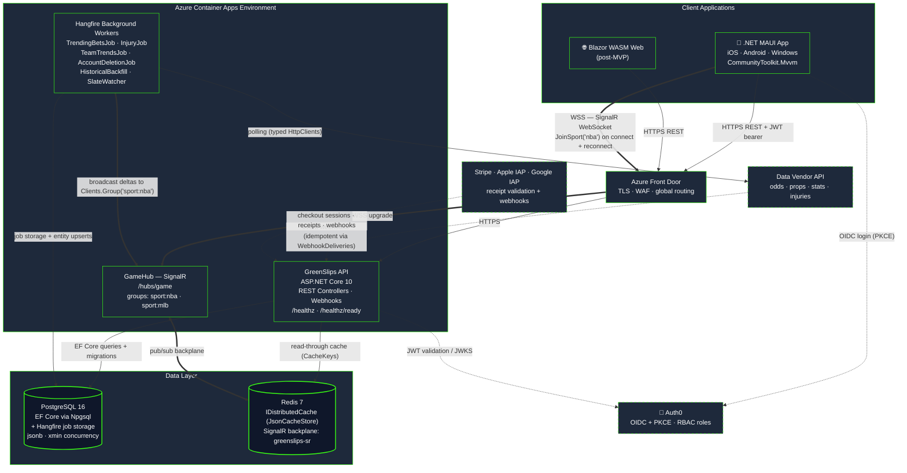

# GreenSlips Architecture & Infrastructure 🚀

Welcome to the technical documentation repository for GreenSlips. This repository outlines the system design, deployment strategies, and data pipelines powering the platform.

## 📂 Repository Structure

* `/docs` - System architecture diagrams (Mermaid) and API specifications.
* `/infrastructure` - Sanitized deployment files, container orchestration (Docker), and CI/CD workflows.
* `/ml-pipeline` - Data dictionaries, sanitized feature lists, and ML workflow overviews.
* `/media` - Application screenshots and UI/UX flows.

Here is the complete, copy-pasteable `README.md`. It integrates your architecture diagrams, your ML pipeline, and the specific note regarding the NBA-to-MLB transition. You can drop this directly into your repository.

---

```markdown
# GreenSlips: Predictive Sports Analytics Platform


GreenSlips is a commercial, multi-platform sports analytics and prediction engine. It aggregates real-time vendor data, processes it through custom machine learning models, and delivers low-latency betting insights to users via a cross-platform mobile and web application.

> **Project Status & Roadmap Note:** 
> The architecture and models documented in this repository reflect the **NBA prediction engine**. We are currently executing a multi-sport expansion to **MLB** for our V1 commercial App Store launch this August. The NBA pipeline will be retrained and reactivated ahead of the 2026-2027 season.

---

## 🎥 Technical Walkthrough

[](#) 
*(Link your Loom or YouTube video here)*

---

## ⚙️ System Architecture

Our backend is built for high-throughput data ingestion and low-latency client delivery. It utilizes a **.NET 10** REST API backed by **PostgreSQL** and **Redis**, orchestrated via **Hangfire**.

*   **Real-Time Data Delivery:** **SignalR** pushes live odds, game state changes, and trending bets to subscribed .NET MAUI clients instantly.
*   **Distributed Caching & Backplane:** **Redis** serves as our read-through cache and the pub/sub backplane for SignalR scale-out.
*   **Background Orchestration:** **Hangfire** manages all asynchronous polling, cache invalidation, and ML inference jobs without blocking the main API threads.
*   **Security:** Endpoints are secured via **Auth0** (OIDC + PKCE) with Role-Based Access Control (RBAC). Inbound data webhooks utilize cryptographically verified HMAC-SHA256 signatures to prevent spoofing.



---

## 🧠 AI & Machine Learning Pipeline

Our predictive engine is a Python-based offline pipeline that synthesizes raw tracking, shooting, and playtype data into actionable probabilities.

* **PyTorch Role-Space Embeddings:** We built a custom Autoencoder (64→32→16→8) to compress 25 advanced tracking features into an 8-dimensional continuous role space, replacing discrete clustering.
* **Feature Engineering:** Implements advanced proprietary metrics including **PAPMY** (Positionless Archetype Plus-Minus Yield) and **DUSR v2** (Cosine-similarity-weighted stat redistribution) to accurately project outputs during key player absences.
* **XGBoost Engine:** Gradient-boosted decision trees heavily tuned via **Optuna** (50 trials per target) and optimized using **SHAP** for automated feature pruning (stripping ≤30% low-signal features).
* **Probability Calibration:** Applies **Isotonic Regression** (Scikit-learn) on a held-out temporal validation set to map raw classifier outputs to true probabilities before applying fractional Kelly-criterion bet sizing.

```mermaid
flowchart LR
    classDef default fill:#1E293B,stroke:#39FF14,color:#FFFFFF
    classDef datastore fill:#0F172A,stroke:#39FF14,stroke-width:2px,color:#FFFFFF
    classDef boundary fill:#1E293B,stroke:#39FF14,color:#FFFFFF

    subgraph INGEST["1 · Raw Vendor Ingestion"]
        BDL["Vendor API"]
        NETJOBS[".NET ingestion services<br/>game logs · matchup stats · props"]
        XLSX["historical_lines.xlsx<br/>historical Vegas lines"]
        IMP["Python Ingestion<br/>idempotent INSERT OR REPLACE"]
    end

    DB[("PostgreSQL Data Store<br/>PlayerGameLogsBase · PlayerGameLogsAdvanced<br/>TeamMatchupLogs · MatchupStats<br/>HistoricalGameLines · PlayerPropRows")]

    subgraph FEAT["2 · Feature Engineering"]
        LOAD["Data Loaders"]
        FE["Feature Generation<br/>rolling windows 3/5/10/20<br/>synthetic lines ±3.0"]
        KAL["Kalman Filters<br/>Optuna-tuned Q/R per prop"]
        RAPM["RAPM Engine<br/>prior-season RAPM"]
        VAC["Vacuum Engine<br/>usage redistribution"]
    end

    subgraph EMB["3 · PyTorch Embedding Layer"]
        AE["RoleAutoencoder<br/>25 tracking features → 8-dim latent<br/>64→32→16→8 encoder · StandardScaler"]
        ARCH["Archetype Extractor"]
    end

    subgraph TRAIN["4 · XGBoost Predictive Engine"]
        TUNE["Optuna Tuning"]
        TR["Model Training<br/>SHAP pruning (≤30%)<br/>two-stage evaluation"]
        MODELS["Trained Models<br/>Prop & Game-line targets"]
    end

    subgraph CAL["5 · Scikit-Learn Calibration"]
        ISO["IsotonicRegression<br/>Brier-score validated"]
        PKL["Calibrator Objects"]
    end

    subgraph PRED["6 · Inference & Sync"]
        INF["Prediction Engine<br/>calibrated P(over) · edge vs implied odds<br/>fractional Kelly sizing"]
        SYNC[("PropPredictions ·<br/>GamePredictions tables")]
    end

    BDL --> NETJOBS --> DB
    XLSX --> IMP --> DB
    DB --> LOAD --> FE
    KAL --> FE
    RAPM --> FE
    VAC --> FE
    DB --> AE --> ARCH --> FE
    FE --> TUNE --> TR --> MODELS
    FE --> ISO
    MODELS --> ISO --> PKL
    MODELS --> INF
    PKL --> INF
    FE --> INF
    INF --> SYNC

    class DB,SYNC,MODELS,PKL datastore
    class INGEST,FEAT,EMB,TRAIN,CAL,PRED boundary

```



---

## 🗄️ Database Design Principles

The PostgreSQL schema relies on **Entity Framework Core (Npgsql)**. It is deliberately denormalized to optimize read-heavy slate queries.

* **No physical Foreign Keys:** Referential integrity is enforced at the ingestion layer via composite unique indexes (e.g., `PlayerId`, `PropType`, `GameDate`, `Sport`).
* **Multi-Sport Discriminators:** Every domain table carries a `Sport` enum discriminator to allow seamless multi-sport coexistence.
* **Optimistic Concurrency:** Hot tables utilize PostgreSQL's `xmin` system column as an EF Core concurrency token to safely manage race conditions between webhook updates and background polling jobs.
* **JSONB Escape Hatches:** Select tables leverage `jsonb` columns to store sparse vendor metrics without database column explosion.

*(View the `docs/` folder for the complete Entity Relationship Diagram and OpenAPI spec.)*

---

## 🔒 Confidentiality Disclaimer

This repository acts as technical documentation and a high-level architectural overview. The proprietary .NET 10 source code, PyTorch model definitions, and custom ML feature-engineering algorithms have been omitted to protect the intellectual property of the commercial platform.

```

```
