# GreenSlips: Predictive Sports Analytics Platform

GreenSlips is a commercial, multi-platform sports analytics and prediction engine. It aggregates real-time vendor data, processes it through custom machine learning models, and delivers low-latency betting insights to users via a cross-platform mobile and web application.

> **Project Status & Roadmap Note:**
> The architecture and models documented in this repository reflect the **NBA prediction engine**. We are currently executing a multi-sport expansion to **MLB** for our V1 commercial App Store launch this August. The NBA pipeline will be retrained and reactivated ahead of the 2026-2027 season.

---

## 🎥 Technical Walkthrough

*(Link your Loom or YouTube video here)*

---

## ⚙️ System Architecture

The .NET MAUI client authenticates against Auth0 (OIDC + PKCE) and talks to the ASP.NET Core 10 API over two distinct channels: HTTPS REST for stats/odds/props, and a persistent SignalR WebSocket to `GameHub` at `/hubs/game` for sub-5-second live pushes[cite: 8]. SignalR is backed by a Redis backplane (channel prefix `greenslips-sr`), so broadcasts fan out correctly across container replicas[cite: 8]. Hangfire (PostgreSQL-backed storage) runs the recurring ingestion jobs that poll the BallDontLie vendor API and broadcast deltas to sport-scoped groups (`sport:nba`, `sport:mlb` — see ADR-0003)[cite: 8].

---

## 🧠 AI & Machine Learning Pipeline

The Python pipeline (`src/SportsModel`) is a six-stage offline pipeline[cite: 8]. Player-tracking profiles are compressed by a PyTorch autoencoder into an 8-dimensional continuous "role space" (replacing discrete K-Means archetypes); those embeddings join Kalman-filtered form features and RAPM priors as inputs to per-prop XGBoost models (points, assists, rebounds, blocks, steals, threes) plus three game-line models (moneyline, spread, total)[cite: 8]. Raw classifier outputs are calibrated with scikit-learn Isotonic Regression before Kelly-criterion bet sizing[cite: 8].

```mermaid
flowchart LR
    classDef default fill:#1E293B,stroke:#39FF14,color:#FFFFFF
    classDef datastore fill:#0F172A,stroke:#39FF14,stroke-width:2px,color:#FFFFFF
    classDef boundary fill:#1E293B,stroke:#39FF14,color:#FFFFFF

    subgraph INGEST["1 · Raw Vendor Ingestion"]
        BDL["BallDontLie API"]
        NETJOBS[".NET ingestion services<br/>game logs · matchup stats · props"]
        XLSX["nba_gamelines_2008-2025.xlsx<br/>historical Vegas lines"]
        IMP["import_vegas_lines.py<br/>idempotent INSERT OR REPLACE"]
    end

    DB[("Relational store<br/>PlayerGameLogsBase · PlayerGameLogsAdvanced<br/>TeamMatchupLogs · MatchupStats<br/>HistoricalGameLines · PlayerPropRows")]

    subgraph FEAT["2 · Feature Engineering"]
        LOAD["db.py loaders"]
        FE["features.py<br/>rolling windows 3/5/10/20<br/>synthetic lines ±3.0"]
        KAL["kalman.py<br/>Optuna-tuned Q/R per prop"]
        RAPM["rapm.py<br/>prior-season RAPM"]
        VAC["vacuum.py<br/>usage redistribution"]
    end

    subgraph EMB["3 · PyTorch Embedding Layer"]
        AE["autoencoder.py — RoleAutoencoder<br/>25 tracking features → 8-dim latent<br/>64→32→16→8 encoder · StandardScaler"]
        ARCH["archetypes.py<br/>load_saved_embeddings()"]
    end

    subgraph TRAIN["4 · XGBoost Predictive Engine"]
        TUNE["tune.py — Optuna<br/>50 trials per target"]
        TR["train.py<br/>SHAP pruning (≤30%)<br/>two-stage: blocks · steals<br/>temporal 80/20 split"]
        MODELS["models/*.json<br/>6 prop models +<br/>moneyline · spread · total"]
    end

    subgraph CAL["5 · Scikit-Learn Calibration"]
        ISO["calibrate.py<br/>IsotonicRegression on hold-out<br/>Brier-score validated"]
        PKL["models/*_calibrator.pkl"]
    end

    subgraph PRED["6 · Inference & Sync"]
        INF["predict.py<br/>calibrated P(over) · edge vs implied odds<br/>fractional Kelly sizing (¼, cap 5%)"]
        SYNC[("PropPredictions ·<br/>GamePredictions tables")]
        XL["Excel report<br/>(openpyxl)"]
    end

    BDL --> NETJOBS --> DB
    XLSX --> IMP --> DB
    DB --> LOAD --> FE
    KAL --> FE
    RAPM --> FE
    VAC --> FE
    DB --> AE --> ARCH --> FE
    FE --> TUNE --> TR --> MODELS
    FE --> ISO
    MODELS --> ISO --> PKL
    MODELS --> INF
    PKL --> INF
    FE --> INF
    INF --> SYNC
    INF --> XL

    class DB,SYNC,MODELS,PKL datastore
    class INGEST,FEAT,EMB,TRAIN,CAL,PRED boundary

```

---

## 🗄️ Database Design Principles

The schema is intentionally **denormalized for read-heavy slate queries**: there are no enforced foreign-key constraints or EF navigation properties[cite: 8]. Tables are correlated through shared `PlayerId` / `TeamId` / `GameId` keys (vendor identifiers) enforced by composite **unique indexes**, with `PlayerIdMappings` reconciling BallDontLie IDs against NBA Stats IDs[cite: 8]. Every domain table carries a `Sport` discriminator (default `Nba`) for the multi-sport rollout, and hot tables use PostgreSQL's `xmin` system column for optimistic concurrency[cite: 8].

```mermaid
erDiagram
    PlayerIdMappings ||--o{ PlayerPropRows : "PlayerId (logical)"
    PlayerIdMappings ||--o{ PlayerGameLogsBase : "PlayerId (logical)"
    PlayerIdMappings ||--o{ PlayerGameLogsAdvanced : "PlayerId (logical)"
    PlayerIdMappings ||--o{ PlayerSeasonAverages : "PlayerId (logical)"
    PlayerIdMappings ||--o{ RawStats : "PlayerId (logical)"
    PlayerGameLogsBase |o--o| PlayerGameLogsAdvanced : "PlayerId + GameId + Period"
    TeamMatchupLogs ||--o{ PlayerGameLogsBase : "TeamId + GameId (logical)"
    TeamMatchupLogs ||--o{ TeamTrends : "TeamId + GameId (logical)"
    TeamMatchupLogs ||--o{ TeamSeasonAverages : "TeamId + Season (logical)"
    PlayerGameLogsBase }o--|| MatchupStats : "aggregated into (TeamId + PropCategory)"
    PlayerPropRows }o--|| TrendingBets : "GameId (logical)"
    Subscriptions }o--|| AccountDeletionRecords : "UserSub (Auth0 subject)"

    PlayerPropRows {
        int Id PK
        enum Sport "discriminator, default Nba"
        int PlayerId UK "vendor player id"
        string PropType UK "points, rebounds, ..."
        date GameDate UK
        bigint GameId
        double Line
        int OverOdds
        int UnderOdds
        string HitRateL5_L10_L20 "+ season + H2H"
        int OpponentTeamId
        int DefenseRank
        bool IsLocked "premium gating"
        timestamptz LastUpdated "default now()"
        xid RowVersion "xmin concurrency token"
    }

    PlayerGameLogsBase {
        int Id PK
        enum Sport UK
        int PlayerId UK
        bigint GameId UK
        int Period UK "0 = full game"
        date GameDate "indexed"
        int Season
        int TeamId "indexed"
        int OpponentTeamId
        bool IsHome
        bool IsStarter
        string MinutesPlayed
        int Pts_Ast_Reb_Stl_Blk "box score columns"
        int Fgm_Fga_Fg3m_Fg3a_Ftm_Fta
        timestamptz LastUpdated
    }

    PlayerGameLogsAdvanced {
        int Id PK
        enum Sport UK
        int PlayerId UK
        bigint GameId UK
        int Period UK
        int TeamId "indexed"
        double Pace_OffRating_DefRating
        double UsagePct_EFgPct_TrueShootingPct
        double Touches_Passes_Deflections "V2 tracking"
        double MatchupMinutes_MatchupFgPct
        timestamptz LastUpdated
    }

    TeamMatchupLogs {
        int Id PK
        enum Sport UK
        int TeamId UK
        bigint GameId UK
        date GameDate "indexed"
        int Season
        int OpponentTeamId
        int PointsInPaint_FastBreakPoints
        double FreeThrowAttemptRate_TovPct
        double OppEFgPct_OppORebPct "four factors"
        timestamptz LastUpdated
    }

    MatchupStats {
        int Id PK
        enum Sport UK
        int TeamId UK
        string PropCategory UK
        string PositionBucket UK "default ALL"
        int Season UK
        string WindowType UK "default Full"
        int DefensiveRank
        double AllowedAvg
        int GamesCount
        timestamptz LastUpdated
    }

    PlayerSeasonAverages {
        int Id PK
        enum Sport UK
        int PlayerId UK "indexed"
        int Season UK "indexed"
        string Category UK
        string Type UK
        jsonb JsonData
        double ShootingZoneColumns "RA, paint, midrange, corner-3, ATB-3"
        timestamptz UpdatedAt
    }

    TeamSeasonAverages {
        int Id PK
        enum Sport UK
        int TeamId UK
        int Season UK
        string Category UK
        string Type UK
        jsonb MetricsJson
        double OppShootingZoneColumns "defense by zone"
        timestamptz LastUpdated
    }

    TeamTrends {
        int Id PK
        enum Sport UK
        int TeamId UK
        date GameDate UK "indexed"
        bigint GameId
        string BetType
        string LineValue
        string HitRateL5_L10_L20 "+ season + H2H"
        double Score
        timestamptz LastUpdated
    }

    TrendingBets {
        int Id PK
        enum Sport
        bigint GameId "indexed"
        string BetType
        string TeamOrPlayer
        double PublicPct
        double LineShift
        bool IsLocked
        xid RowVersion
        timestamptz UpdatedAt
    }

    InjuryReports {
        int Id PK
        enum Sport
        string PlayerName
        string Team
        string InjuryType
        string Status
        string EstimatedReturn
        bool IsLocked
        xid RowVersion
        timestamptz UpdatedAt
        timestamptz FirstSeenAt
    }

    PlayerIdMappings {
        int Id PK
        enum Sport UK
        string PlayerName UK
        int BdlPlayerId "BallDontLie id"
        int NbaPlayerId "NBA Stats id"
    }

    RawStats {
        int Id PK
        enum Sport
        int PlayerId
        int TeamId
        bigint GameId
        int Season
        jsonb JsonData "raw vendor payload"
    }

    WebhookDeliveries {
        int Id PK
        string Vendor UK
        string EventId UK "idempotency key"
        timestamptz ReceivedAt "default now()"
        timestamptz ProcessedAt
    }

    Subscriptions {
        guid Id PK
        string UserSub "Auth0 subject, indexed"
        string Sku
        string Status "indexed with UserSub"
        string Provider "stripe, apple, google"
        string ProviderSubscriptionId
        timestamptz StartedAt
        timestamptz ExpiresAt
        timestamptz LastReceiptVerifiedAt
    }

    AccountDeletionRecords {
        int Id PK
        string UserSub "indexed"
        string Status "default Pending"
        timestamptz RequestedAt "default now()"
        timestamptz CompletedAt
        string ErrorMessage
    }

```

---

## 🔒 Confidentiality Disclaimer

This repository acts as technical documentation and a high-level architectural overview. The proprietary .NET 10 source code, PyTorch model definitions, and custom ML feature-engineering algorithms have been omitted to protect the intellectual property of the commercial platform.
